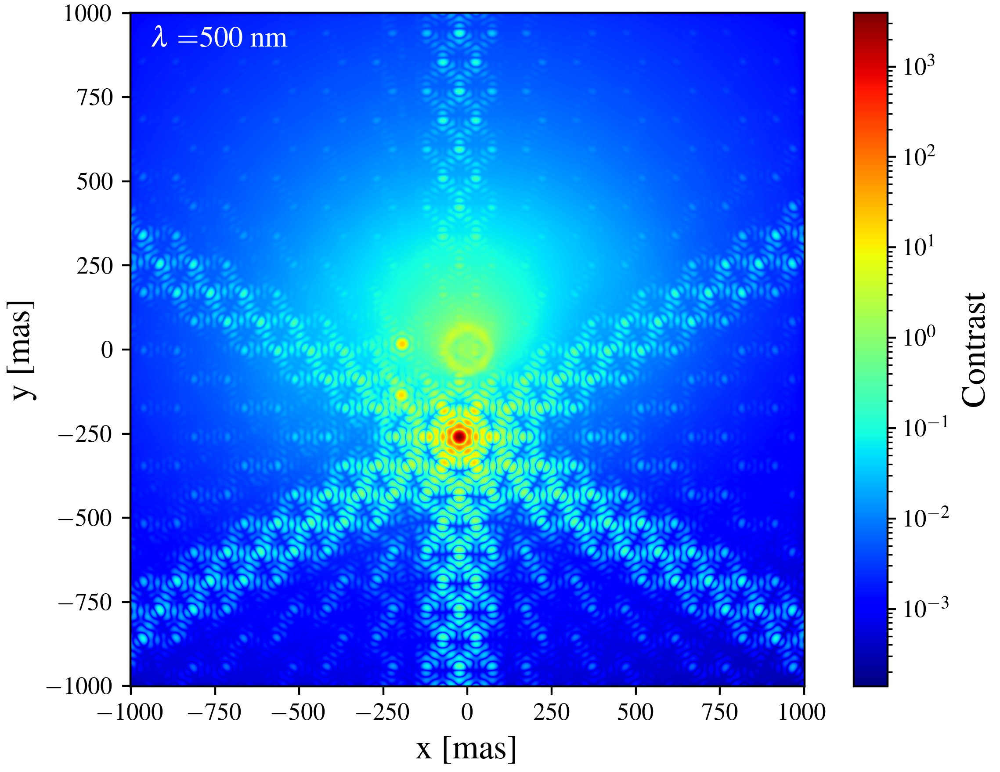

# PyStarshade

[](https://www.gnu.org/licenses/gpl-3.0)

## Overview

Developed by Jamila Taaki (MIDAS fellow).

PyStarshade is a Python library for Starshade (or any external occulter) simulations from star-planet system to CCD with Fresnel diffraction methods. This library efficiently calculates output fields using Bluestein FFTs.

What is a starshade? A starshade is a particular apodization (mask), which flown at Fresnel distances from a telescope achieves star-light suppression for imaging exoplanets in orbit around the star. 

Numerical diffraction calculations for a starshade must use a very small numerical resolution $d u$ of the starshade $s(u, v)$ in order to accurately calculate starlight suppression. Using a standard FFT to perform these calculations is inefficient as very large zero-padding factors are needed to sample the field at the telescope aperture. The Bluestein FFT is a technique to calculate arbitrary spectral samples of a propagated field, indirectly using FFTs and therefore benefiting from their efficiency. For an $N \cdot N$ starshade mask, and an $M \cdot M$ telescope aperture, the Bluestein FFT approach achieves a complexity of $O((N+M)^2 \log (M+N))$. This technique is utilized in multiple aspects of the optical train to efficiently propagate fields.


## Example
Simulated imaging of a synthetic exoscene (ExoVista) with three visible exoplanets at a
wavelength of 500 nm. A 60 m starshade configuration and a 6m segmented pupil was used for this
example.
<p align="center">
  
</p>

## Installation

You can install PyStarshade using pip:

```bash
pip install pystarshade
```

Or to use pre-computed data, use [git lfs](https://git-lfs.com): 
```bash
$ git clone https://github.com/xiaziyna/PyStarshade.git PyStarshade
$ cd PyStarshade
$ git lfs pull
pip install -e .
```

## Dependencies

Scipy, Numpy,

Optional: HCIPy, astropy

## Quickstart

Detailed [documentation](https://pystarshade.readthedocs.io/en/latest/) for all PyStarshade utilities.

### Input data

PyStarshade can take as input any pixelized source-field such as Haystacks model, or analytic descriptions of sources
(so far a point source and Gaussian source). If you wish to perform propagation using analytic descriptions, please 
use 'pystarshade.simulate_field.point_source_to_ccd'.

The easiest way to interface with PyStarshade is via the StarshadeProp class. Generate fields/psf models for a chosen design reference mission (drm).
Simulate imaging for a 'source_field' with a default 2 mas sampling.

```python
    from pystarshade.propagator import StarshadeProp

    drm = 'hwo'
    hwo_starshade = StarshadeProp(drm = drm)
    hwo_starshade.gen_pupil_field()

    pupil_type = 'hex'
    hwo_starshade.gen_psf_basis(pupil_type = pupil_type)
    focal_intensity = hwo_starshade.gen_scene(pupil_type, source_field.astype(np.float32), 500e-9)
```


### Worked examples

See examples folder for different simulation examples.

## Contributing

Feel free to reach out if you'd like to discuss contributing or go ahead and submit a pull request!
Try to keep any pull requests limited in scope. 
If there is demand for extra functionality, I am happy to help add these in.

## License

[PyStarshade] is released under the [GNU General Public License v3.0](LICENSE).
