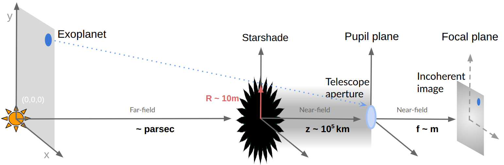

Starshade Basics
----------------

What is a Starshade?
~~~~~~~~~~~~~~~~~~~

A **starshade** is a large, petal-shaped spacecraft designed to work in tandem with a space telescope for the direct imaging of exoplanets. Acting as an external occulter, it flies in precise formation with the telescope, positioned tens of thousands of kilometers away, to block the bright light from a star while allowing the faint light from orbiting planets to reach the telescope's aperture.

How Does a Starshade Work?
~~~~~~~~~~~~~~~~~~~~~~~~~

The starshade creates a shadow by suppressing starlight through diffraction. Its petal-like design minimizes light scattering around the edges, producing a dark region where the telescope can observe. When aligned with a target star, the starshade reduces the star's light by a factor of :math:`10^{-10}` to :math:`10^{-11}` as demonstrated in subscale tests, enabling the detection of planets that are billions of times fainter. The starshade can maintain this contrast over a broad wavelength range, from ultraviolet (UV) to near-infrared (NIR). Thereby allowing for the detection and characterization of planetary atmospheres, including the search for biosignatures such as water vapor (H₂O), oxygen (O₂), carbon dioxide (CO₂), methane (CH₄), and ozone (O₃). Furthermore, starlight is supppressed prior to light entering the telescope aperture, a starshade maintains a high level of optical throughput (close to or around 100%). In PyStarshade you can simulate throughput for different apertures. 

Figure: Starshade Concept
~~~~~~~~~~~~~~~~~~~~~~~~

*Caption:* A starshade blocks starlight, casting a shadow on the telescope, allowing planet light to be imaged.  

For more on starshade science, see resources like `Mennesson et al. (2024) <https://doi.org/10.1117/1.JATIS.10.3.035004>`_ or `Shaklan et al. (2023) <https://doi.org/10.1117/12.2677793>`_.

----

Optical Model Overview
---------------------

PyStarshade is built upon a Fourier optics model that simulates the propagation of light from an exoplanetary scene through a starshade and telescope system. The model consists of two main stages of optical propagation:

1. **Starshade to Telescope Aperture (Fresnel Diffraction):**  
   Light from the exoplanetary scene, modeled as a collection of point sources, propagates to the starshade. The starshade mask diffracts the on-axis light, and this diffracted field is calculated at the telescope aperture using Fresnel diffraction. For an on-axis source, the diffracted field at wavlength :math:`\lambda` is :math:`f_{P,\lambda}^0` is computed as:
   
   .. math::
      
      f_{P,\lambda}^0[x, y] = \frac{e^{\frac{i\pi}{\lambda z}(x^2 + y^2)}}{\lambda z} \mathcal{F}\left( s[\zeta, \eta] e^{\frac{i\pi}{\lambda z}(\zeta^2 + \eta^2)} \right) \left[ \frac{x}{\lambda z}, \frac{y}{\lambda z} \right]
   
   where :math:`s[\zeta, \eta]` is the starshade mask, :math:`\lambda` is the wavelength, and :math:`z` is the distance between the starshade and telescope. A starshade will diffract light for sources within an angular separation of the axis of approximately :math:`2 * R_{ss} / z` - :math:`R_{ss}` is the starshade radius and :math:`z` is the starshade-telescope flight distance. 

2. **Telescope Aperture to Focal Plane (Fraunhofer Diffraction):**  
   The diffracted field at the aperture is then propagated through the telescope's optical system to the focal plane, where the point-spread function (PSF) is formed. The PSF :math:`\psi^\lambda` for a source at position :math:`\phi` is given by:
   
   .. math::
      
      \psi^\lambda[\mathbf{x}] = \left| \frac{e^{\frac{i\pi}{\lambda f}(x^2 + y^2)}}{j \lambda f} \mathcal{F}\left( f_{P,\lambda}[\zeta, \eta] \cdot P[\zeta, \eta] \right) \left[ \frac{x}{\lambda f}, \frac{y}{\lambda f} \right] \right|^2
   
   where :math:`P[\zeta, \eta]` is the telescope aperture function and :math:`f` is the focal length.

Starshade Concepts
=================

- **Habitable Worlds Observatory (HWO)**: Utilizes a 35 m diameter Starshade for UV observations or a 60 m diameter for broadband coverage, designed to achieve high-contrast imaging for exoEarth characterization [Shaklan2024]_.
- **Starshade Rendezvous Probe**:A 26 m diameter Starshade designed to rendezvous with Romans 2.4 m telescope [StarshadeProbe2017]_ [S5Website]_.
- **Earth-Orbiting Hybrids**: Employs a large 100 m diameter Starshade in elliptical orbits, designed to collaborate with ground-based Extremely Large Telescopes for enhanced observations [Peretz2021]_.
- **Inflatable Starshade**: An innovative concept exploring inflatable structures for Starshade deployment, aimed at reducing launch mass and complexity [NIAC2025]_.

.. [Shaklan2024] Shaklan S. et al. 2024, SPIE, 13092, 130925D
.. [StarshadeProbe2017] Starshade Probe Report 2017, https://science.nasa.gov/wp-content/uploads/2023/04/Starshade2.pdf?emrc=c29363
.. [S5Website] S5 Website: https://exoplanets.nasa.gov/exep/technology/starshade/
.. [Seager2015] Seager S. et al. 2015, SPIE, 9605, 96050W
.. [Lisman2019] Lisman P.D. and Schwieterman E.W. 2019, BAAS, 51, 217
.. [Gaudi2020] Gaudi et al. 2020, arXiv:2001.06683
.. [Peretz2021] Peretz E. 2021, JATIS, 7, 021213
.. [NIAC2025] Inflatable Starshades for Earthlike Exoplanets NASA NIAC 2025 Phase I
