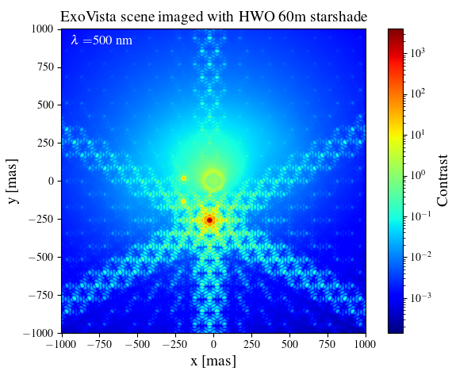

# Summary

Starshades are external occulting masks designed to suppress starlight by a factor of $10^{-11}$ or more to image faint Earth-Sun analogs. Beyond this overarching task lay specific questions about the configurations of exoplanetary systems that may be imaged, which spectral features can be characterized, and which instrument designs are most suitable. 'PyStarshade' is a Python toolbox to efficiently perform optical simulations of starshades with exoplanetary scenes to assess the utility of starshades in future direct-imaging missions.

# Statement of need
`PyStarshade` provides a toolbox for performing optical simulations from source to focal plane with a configurable starshade telescope design. To do these optical simulations, fields are calculated at three planes of propagation (starshade, telescope aperture and focal plane) using Fresnel or Fraunhofer diffraction formula where appropriate. First-order imaging characteristics of a starshade can be determined from analytic relations which depend on the starshades size, telescope aperture size, wavelength and flight distance. `PyStarshade` allows for second order imaging characteristics to be studied, including simulations of imaging for an exoplanetary scene and the effect of telescope aperture. The discretized flux of a model exoplanetary scene can be propagated through a starshade telescope configuration to simulate imaging. An example is provided on using spectral- and time-dependent scenes consisting of planets, star and dust-disk, simulated with `ExoVista` [@Stark_2022], the output is shown in Figure \autoref{fig:example}. `PyStarshade` is intended to be flexible and efficient to allow for studying i) exoplanet retrievals, ii) instrument design and parameter choices.

Aimed at being broadly useful for numerically intense Fourier optical simulations, tools are provided for efficient Fresnel and Fraunhofer propagation using Fourier spectral sampling with Bluestein Fast Fourier Transforms (FFT). Furthermore, a novel technique to chunk these FFT calculations is implemented and mitigates memory bottlenecks. A set of unit tests are provided to validate the Fourier diffraction tools. 'PyStarshade' pre-computes fields, point-spread-functions and throughput grids for different stages of the optical propagation chain, allowing for flexibility in modifying instrument parameters or telescope aperture masks. 'PyStarshade' interfaces with HCIPy to generate telescope apertures and the resulting imaging in a streamlined fashion. 

# Related software
The Starshade Imaging Simulation Toolkit for Exoplanet Reconnaissance (`SISTER`) [@sisters:2022] implemented in Matlab performs detailed end-to-end simulations of starshade imaging, further including instrument noise sources such as solar glint, and tools for modeling an exoplanetary system and background objects. The 'SISTER' tool performs diffraction calculations from starshade to telescope aperture using the boundary diffraction wave method due to [@cady]. `fresnaq` @fresnaq is a Matlab code to efficiently compute diffraction of a starshade at the telescope aperture via the NUFFT @barnett. `Diffraq` [@Diffraq] is a Python implementation of `fresnaq`, this toolbox also provides an implementation of the boundary diffraction wave method and tools to generate starshade masks [@harness].  The Exoplanet
Open-Source Imaging Mission Simulator ('EXOSIMS') [@exosims] provides methods for orbital simulation of starshades and fuel consumption calculations.

# Acknowledgements

This project is supported by Schmidt Sciences, LLC.

# References
